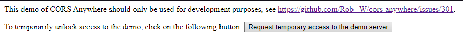
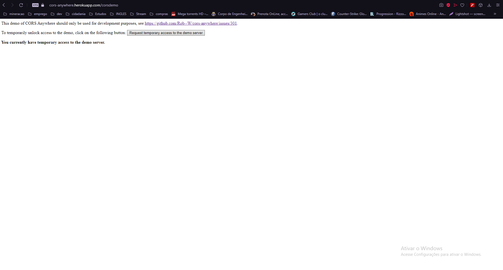

## Como acessar o webapp

- Primeiro acesse esse link "https://cors-anywhere.herokuapp.com" e clique no botao "Request temporary access..."

- Apos clicar irá aparecer essa mensagem, informando que o acesso está liberado

- Agora é só entrar no link do webApp, aqui: https://manipulae-teste.netlify.app